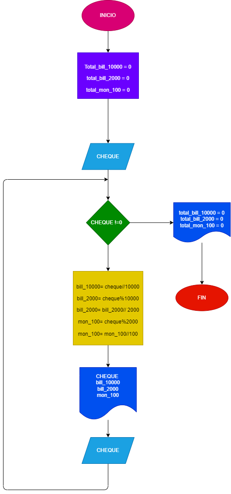

# Ejercicio de cajero 

## EL cajero de un banco solo disponbe de billetes de $10.000, $2.000 y monedas de $100. Su funcion es cambiar los cheques a los clientes, dandoles el menor numero posible de billetes. Asumiendo que todos los cheques son multiplos de $100, hacer el diagrama de flujo y el programa en python que reciba el valor del cheque a cambiar y que le informe al cajero cuantos billetes de cada denominacion debe entregar. Como no se sabe cuantos clientes vienen al día, el programa debe terminar cuandoreciba cero como el valor del cheque, y al final del día debe informar cuántos billetes de cada denominación se gastaron.

